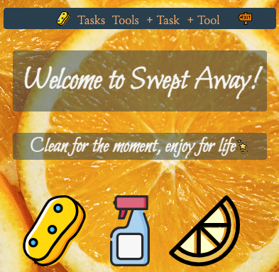

# Swept Away

##
Swept Away is an application to keep you on track with cleaning- so you can enjoy more life!

## Getting Started
* [Check out the site!](https://swept-away-rlk.herokuapp.com/)
* [Github Repo](https://github.com/rharen11/swept-away)
* [Trello Planning](https://trello.com/b/tpM0bBsN/swept-away)

## Technologies Used
_______

 

 

## Credits
* SVG Icons available [here](https://www.svgrepo.com/)

## Ice Box
* Alerts to clean
* Tab on each task to show length of time since cleaned
* Calender to pick dates 